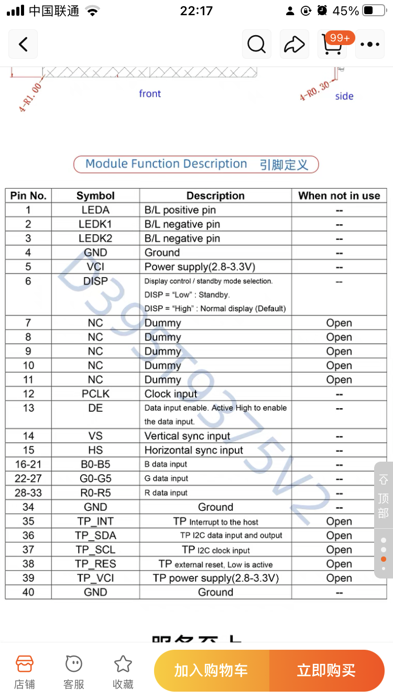
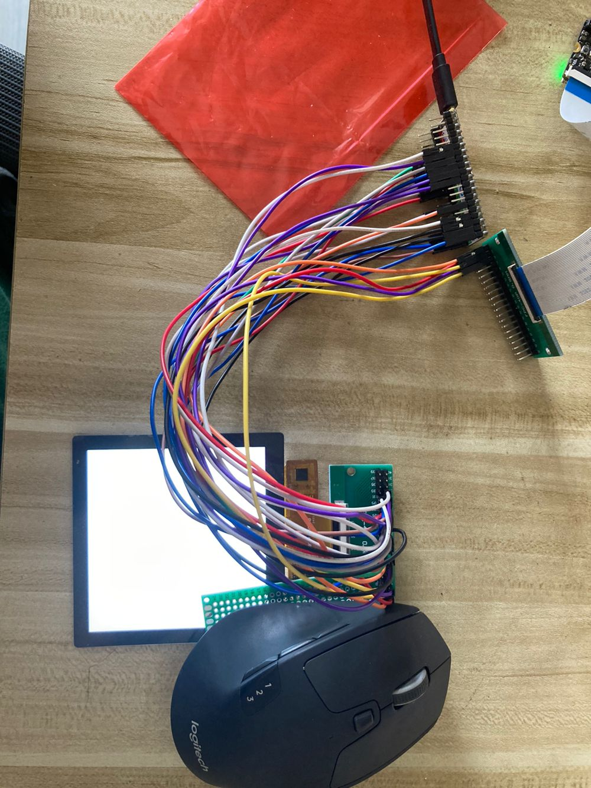
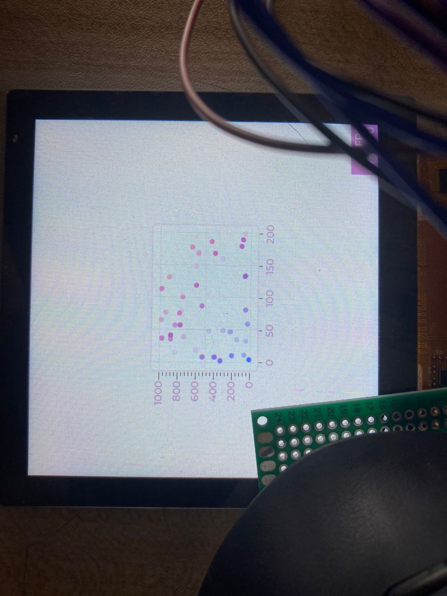
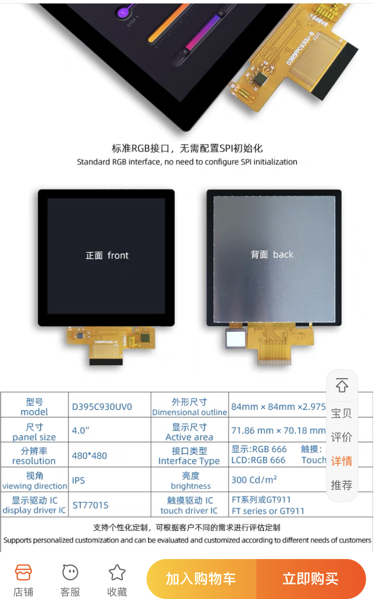

# 项目名称
esp32s3驱动RGB666屏幕(86盒)

# 使用物料
- esp32s3(用的嘉立创，选择其他接口多的也可以)
- 屏幕驱动电路(需要自己画，或者找有驱动电路的开发板接出来)
- 4inch_RGB屏幕(86盒)
- 排线或者杜邦线(用于连接)
# 接线
设置时钟，以及对应引脚
```
#define EXAMPLE_LCD_PIXEL_CLOCK_HZ     (15 * 1000 * 1000)
#define EXAMPLE_LCD_BK_LIGHT_ON_LEVEL  1
#define EXAMPLE_LCD_BK_LIGHT_OFF_LEVEL !EXAMPLE_LCD_BK_LIGHT_ON_LEVEL
#define EXAMPLE_PIN_NUM_BK_LIGHT       4  // LEDA 需要有驱动电路，备注为屏幕引脚    
#define EXAMPLE_PIN_NUM_HSYNC          46 // HS 15
#define EXAMPLE_PIN_NUM_VSYNC          3  // VS 14
#define EXAMPLE_PIN_NUM_DE             16 // DE 13
#define EXAMPLE_PIN_NUM_PCLK           21 // PCLK 12
#define EXAMPLE_PIN_NUM_DATA0          14 // B0 16
#define EXAMPLE_PIN_NUM_DATA1          13 // B1 17
#define EXAMPLE_PIN_NUM_DATA2          12 // B2 18
#define EXAMPLE_PIN_NUM_DATA3          11 // B3 18
#define EXAMPLE_PIN_NUM_DATA4          10 // B4 20 
#define EXAMPLE_PIN_NUM_DATA5          39 // G0 22
#define EXAMPLE_PIN_NUM_DATA6          38 // G1 23
#define EXAMPLE_PIN_NUM_DATA7          45 // G2 24
#define EXAMPLE_PIN_NUM_DATA8          48 // G3 25
#define EXAMPLE_PIN_NUM_DATA9          47 // G4 26
#define EXAMPLE_PIN_NUM_DATA10         9  // G5 27
#define EXAMPLE_PIN_NUM_DATA11         1  // R0 28
#define EXAMPLE_PIN_NUM_DATA12         2  // R1 29
#define EXAMPLE_PIN_NUM_DATA13         42 // R2 30
#define EXAMPLE_PIN_NUM_DATA14         41 // R3 31
#define EXAMPLE_PIN_NUM_DATA15         40 // R4 32
#define EXAMPLE_PIN_NUM_DISP_EN        -1
```
注意排线的1到40脚，以及可能需要到正反40PIN_0.5间距排线

配置VS,HS等参数
```
        .timings = {
            .pclk_hz = EXAMPLE_LCD_PIXEL_CLOCK_HZ,
            .h_res = EXAMPLE_LCD_H_RES,
            .v_res = EXAMPLE_LCD_V_RES,
            // The following parameters should refer to LCD spec，需要屏幕厂家提供
            // .hsync_back_porch = 43,
            // .hsync_front_porch = 8,
            // .hsync_pulse_width = 2,
            // .vsync_back_porch = 18,
            // .vsync_front_porch = 12,
            // .vsync_pulse_width = 10,
            .hsync_back_porch = 18,
            .hsync_front_porch = 2,
            .hsync_pulse_width = 2,
            .vsync_back_porch = 18,
            .vsync_front_porch = 2,
            .vsync_pulse_width = 2,
            // .flags.pclk_active_neg = true, 
            .flags.pclk_active_neg = false,
```

# 参考图



# 屏幕
大显伟业D395C930UV0(这家的屏幕不需要配置SPI初始化，但是注意型号，我是买了三块屏试好的, 参数手册卖家会提供)


# 下载
- idf.py build
- idf.py flash

# 参考链接
- 提到的驱动电路
https://blog.csdn.net/LiANn_/article/details/131780268
- 官方文档
https://docs.espressif.com/projects/espressif-esp-iot-solution/zh_CN/latest/display/lcd/rgb_lcd.html
- 开源驱动电路板，可以直接打板，然后焊接，只是焊接FPC40PIN的座子需要会处理连锡。
https://oshwhub.com/jiazuo/86-mian-ban-zui-xiao-ji-tong-ban
